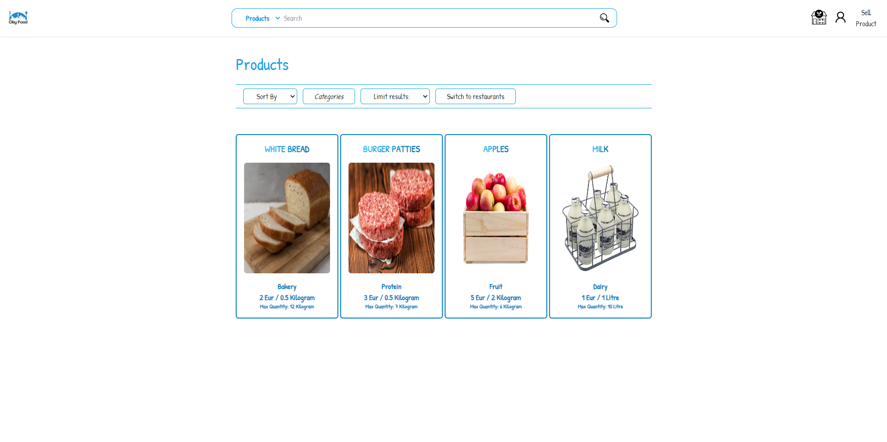
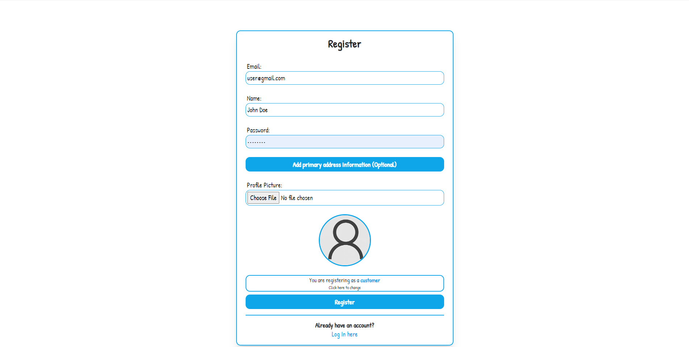
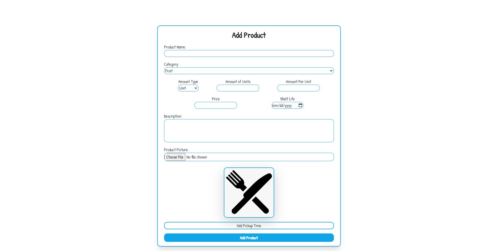
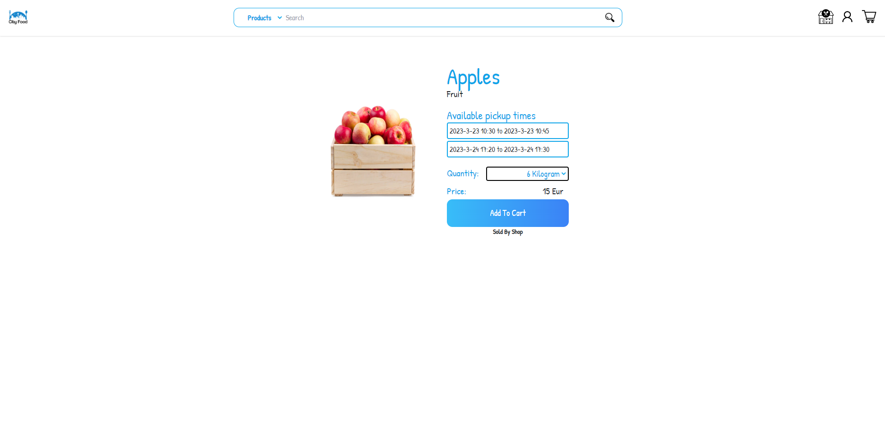
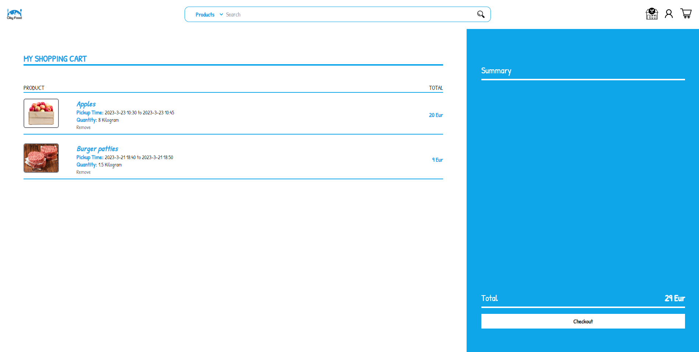
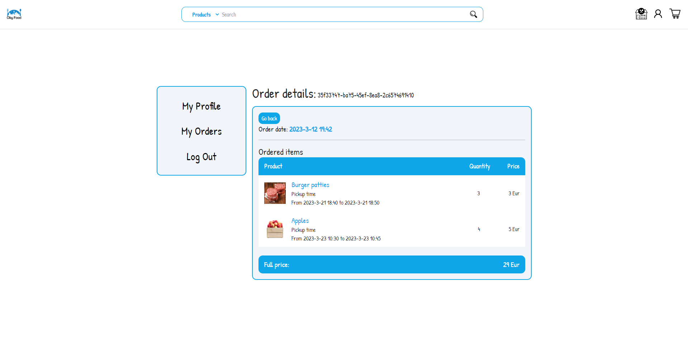

# City Food

## A web app that allows restaurants and grocery stores to sell leftover food for a reduced cost.

Co-developed by Justas Mileika, Medas širokinas, Anton Vaiciukevič in Vilnius University.

#### Responsiblity distribution:

Back-end : Justas Mileika.  
Front-end : Justas Mileika, Medas Širokinas, Anton Vaiciukevič.

Application allows users to register and sign-in as food sellers (restaurants or grocery stores) or food buyers. The food sellers are able to put their items for sale and provide additional information about the item. The buyers can then choose from these items and purchase the desired amount of the food. Purchase history are tracked and shown to the users.

The back-end for the web application has been built using C# ASP.NET framework following the principles of Clean Architecture. The application has 50% test coverage.

***Tech stack used:***

C# ASP.NET  
Azure Cloud Hosting (Database and image storage)  
NLog Logging  
SMTP Email Service  

React JS  
Tailwind CSS

### Demo Images

***Home Page***

***Buyer Registration***

***Product creation***

***Item addition to cart***

***Checkout***

***Order history***

